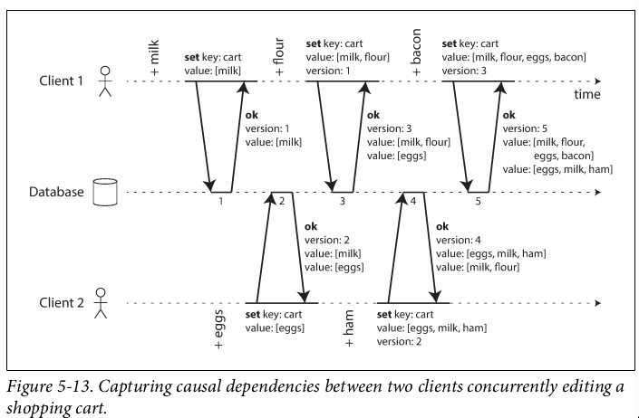
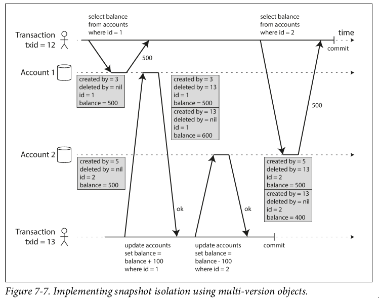
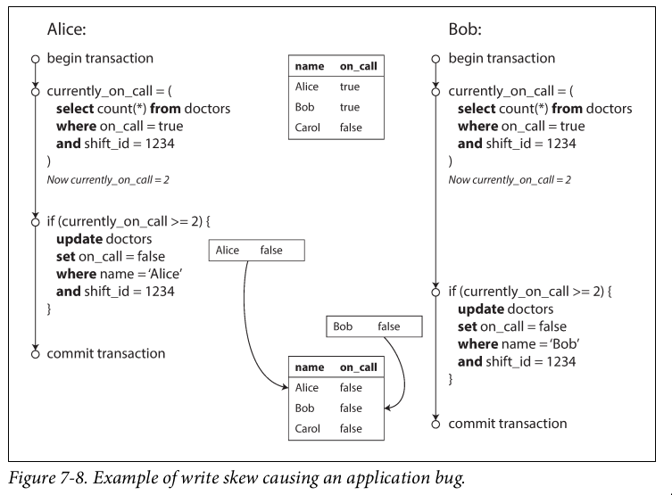
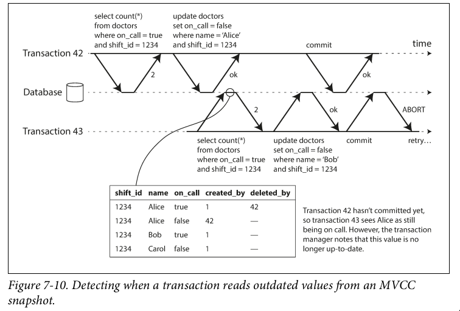
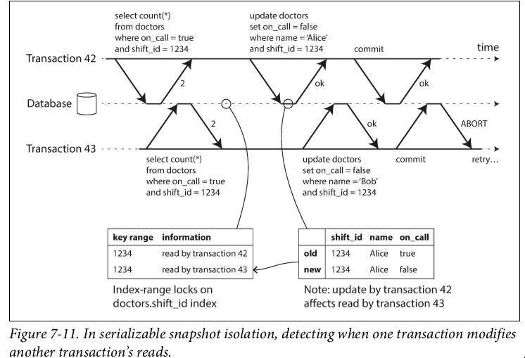
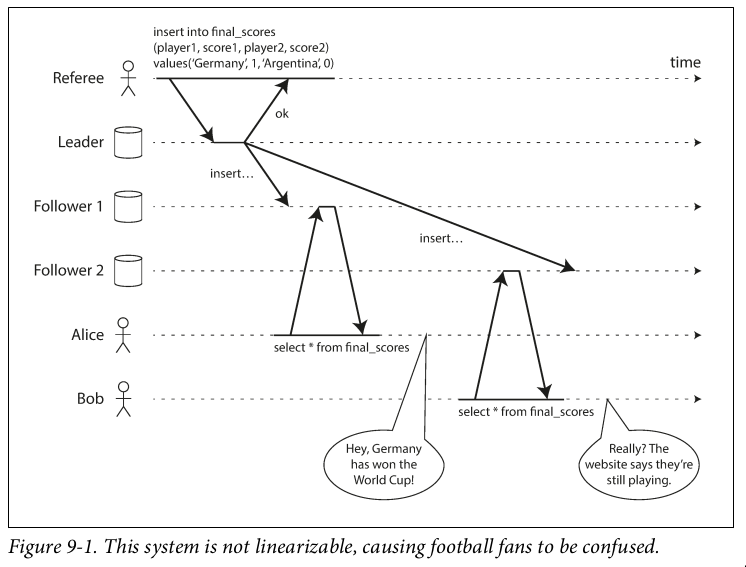
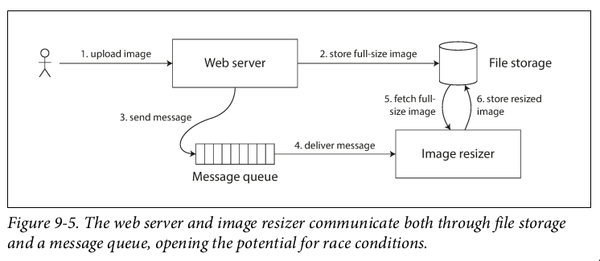

---
presentation:
    theme: night.css
    width: 800
    height: 600
    controls: true
    enableSpeakerNotes: true
----

<!-- slide -->
Log-based vs page-oriented storage

<!-- slide -->
Hash Indexes vs SSTable

<!-- slide -->
LSM-Tree

<!-- slide -->
B-Tree

<!-- slide -->
Read-after-write consistency

<!-- slide -->
Monotonic reads

<aside class="notes">
Sequential reads will read in same order
</aside>

<!-- slide -->
Constant-prefix reads

<aside class="notes">
Read in order of writes
- causal consistency
- hard to maintain because
  could be writes to different partitions
</aside>

<!-- slide -->
Conflict free replicated datatypes

<aside class="notes">
</aside>

<!-- slide -->
Quorum read and write

<!-- slide -->
Last-write wins

<!-- slide -->
Milk, flour, bacon

<!-- slide vertical=true -->

<!-- slide -->
Local and global secondary index

<!-- slide -->
Weak isolation levels

<!-- slide -->
Read committed

<!-- slide -->
Read skew

<!-- slide -->
Snapshot isolation

<!-- slide version=true -->

<!-- slide -->
B-tree append-only/copy-on-write

<!-- slide -->
Write skew

<!-- slide vertical=true -->

<aside class="notes">
Not a dirty write
Nor a lost update
Two transactions update different records
</aside>

<!-- slide -->
Meeting room booking system

<!-- slide vertical=true -->
Materializing phantoms

<!-- slide -->
Predicate lock

<aside class="notes">
May apply to objects that do not exist
</aside>

<!-- slide -->
Index-range lock

<!-- slide -->
Two-phase locking

<!-- slide -->
Serializable Snapshot Isolation (SSI)

<aside class="notes">
detect serialization conflict among writes
</aside>

<!-- slide vertical=true -->

<aside class="notes">
detecting a stale read
</aside>

<!-- slide vertical=true -->

<aside class="notes">
transaction modifies data after it has been read
</aside>

<!-- slide -->
Fencing tokens

<aside class="notes">
Timeout on the lease
- active resource participation
</aside>

<!-- slide -->
Serializability

<aside class="notes">
- isolation guarantee
- *some* serial order
</aside>

<!-- slide -->
Linearizability

<aside class="notes">
- single copy
- recency guarantee
</aside>

<!-- slide vertical=true -->
Football

<!-- slide vertical=true -->
Image resizer

<!-- slide vertical=true -->
Usage

<aside class="notes">
- leader election 
- securing a lock
- unique name
</aside>

<!-- slide -->
Consistency

<!-- slide -->
Causality

<!-- slide -->
Causal order

<!-- slide -->
Total order

<!-- slide -->
Partial order

<!-- slide -->
Linearizability

<!-- slide -->
Stronger of the two

<!-- slide
data-notes="tracks latest - total ordering"
 -->
Lamport timestamp

<aside class="notes">
- tracks latest couters
- maintain total ordering
- have to wait indefinitely for a answer
</aside>

<!-- slide -->
vs Version vectors

<aside class="notes">
tracks causality
</aside>

<!-- slide -->
Total order broadcast

<aside class="notes">
reliable delivery
total order delivery
</aside>

<!-- slide vertical=true -->
Usage

<aside class="notes">
- log replication
- fencing tokens
</aside>

<!-- slide -->
Imply Linearizability?

<aside class="notes">
- no recency guarantee
- can build a linearizable storage
  - need to fetch the latest log position
</aside>

<!-- slide -->
Linearizable storage

<aside class="notes">
Use a atomic increment-and-get operation
</aside>

<!-- slide -->
Two phase commit

<aside class="notes">
In general, 3PC requires a bounded network delay
- so most systems cannot guarantee this
</aside>

<!-- slide -->
Consensus

<aside class="notes">
- uniform agreement - nodes cannot decide differently
- integrity - no node decides twice
- validity - if a node decides v, then v was proposed by some node
- termination - every node that alive decides
  - requires a quorum to continue
</aside>

<!-- slide -->